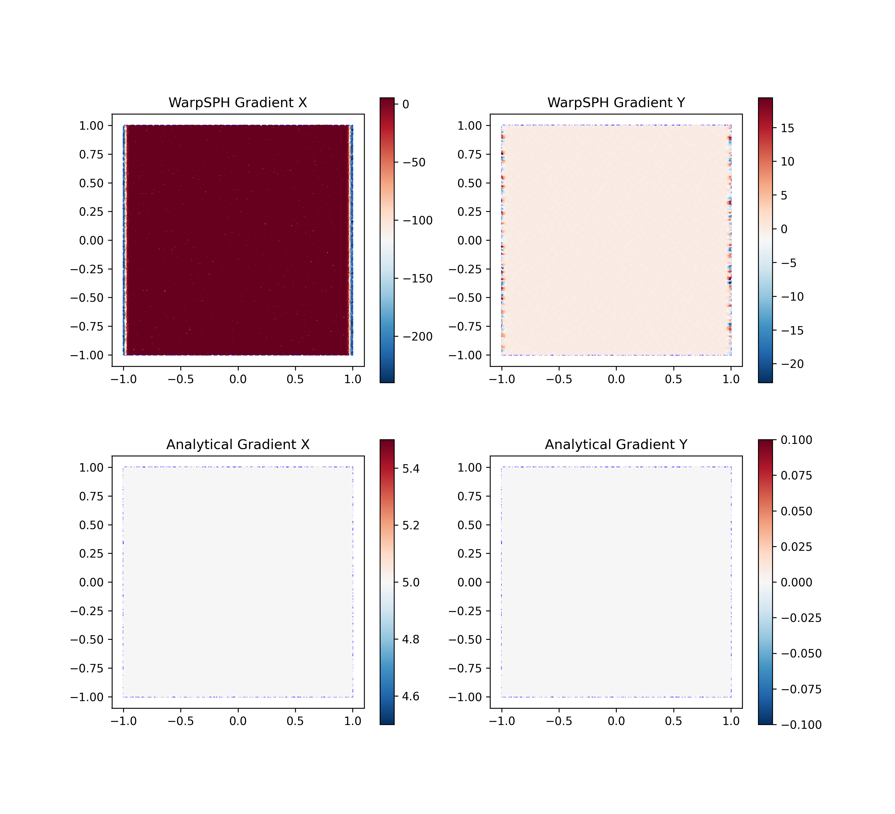
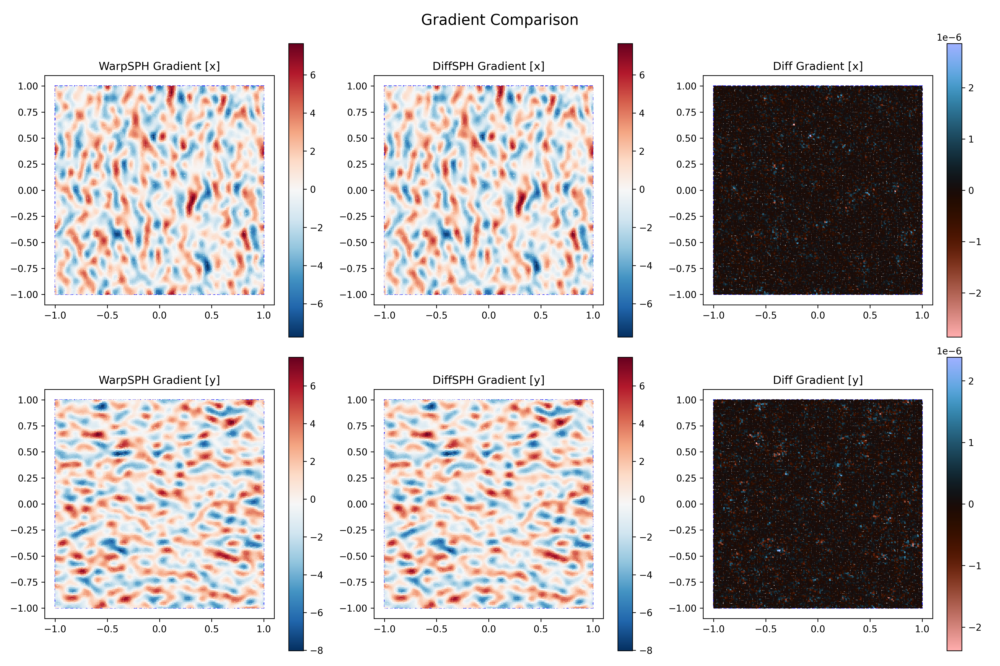
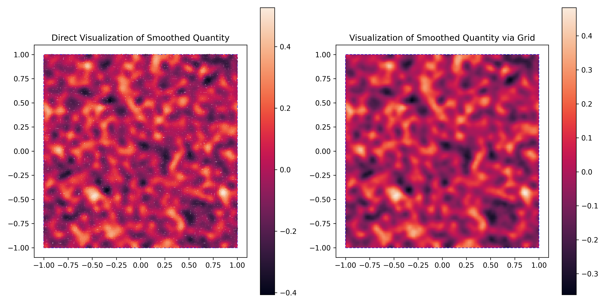
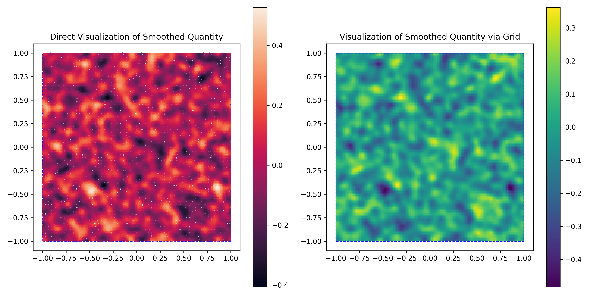
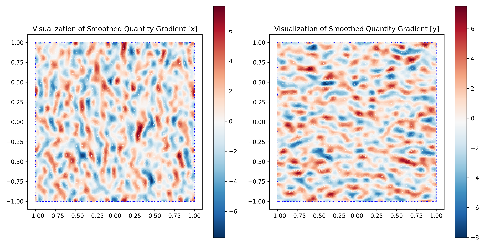
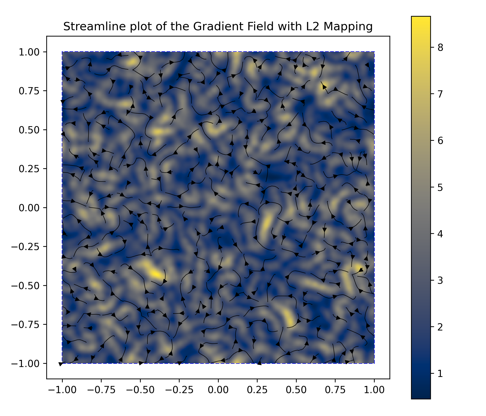
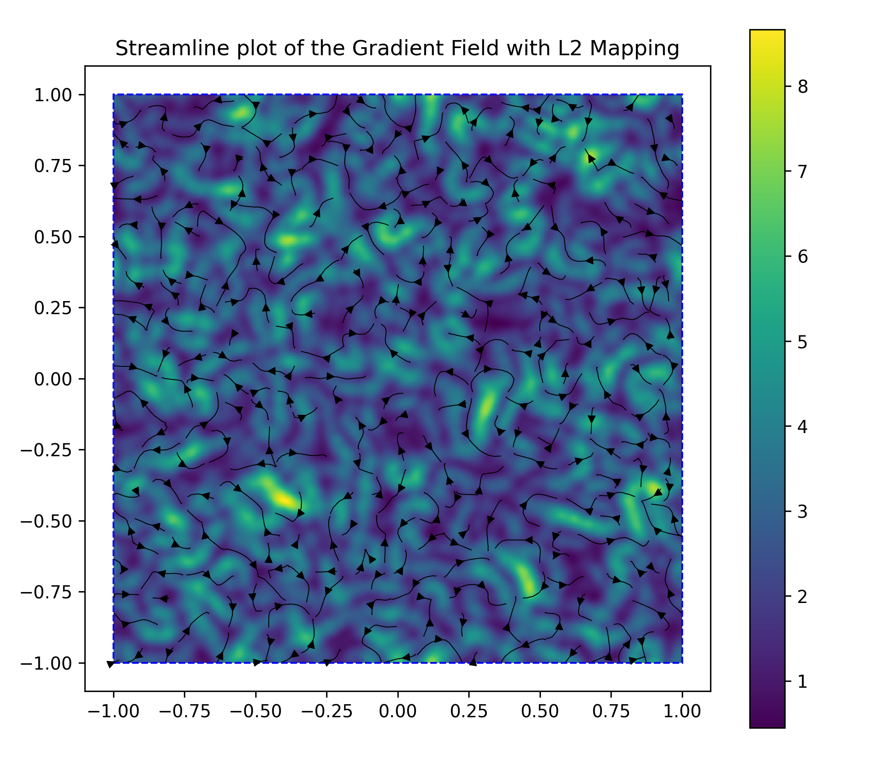

# sphWarpPlotting

`sphWarpPlotting` is a visualization layer for SPH particle data built on top of `sphWarpCore`.
It is designed to make SPH field inspection easy while keeping plotting configurable and update-friendly.

The library centers around two functions:

- `visualizeParticlesNew(...)`: build a plot from particle state, quantity, and plotting options.
- `updatePlot(...)`: update an existing visualization state with new quantities and/or styling.

This repository also includes a full notebook demo in `demo.ipynb` and generated outputs in `output/`.

## What This Library Does

- Visualizes particle scalar fields as scatter plots.
- Visualizes scalar fields on a regular grid (interpolated from particles).
- Applies SPH operations (for example gradients) during plotting.
- Maps vector/tensor quantities to scalars for coloring (`x`, `y`, `L2`, etc.).
- Overlays streamlines for vector fields.
- Supports stateful updates of an existing figure for interactive workflows.

## Installation

From this repository:

```bash
pip install -e .
```

Notebook extras:

```bash
pip install -e .[notebooks]
```

## Core API

```python
from warpPlot import (
    visualizeParticlesNew,
    updatePlot,
    PlottingOptions,
    GridVisualization,
    Mapping,
    PlotScaling,
    ColorMap,
    StreamLineLocation,
)
```

### Main Inputs

- `particleState`: `sphWarpCore.ParticleState`
- `domain`: `sphWarpCore.DomainDescription`
- `quantity`: tensor to visualize (scalar or vector; can be mapped)
- `options`: `PlottingOptions(...)` for rendering and operation behavior

### Main Output

`visualizeParticlesNew` returns a `VisualizationState` object containing figure/axis handles, filtered particle states, and artist handles used by `updatePlot`.

## Minimal Example

```python
import matplotlib.pyplot as plt
from warpPlot import visualizeParticlesNew, PlottingOptions, ColorMap

fig, ax = plt.subplots(1, 1, figsize=(6, 5))

state = visualizeParticlesNew(
    fig,
    ax,
    particleState=particleState,
    domain=domain,
    quantity=f_smoothed,
    options=PlottingOptions(
        colorMap=ColorMap.rocket,
        markerSize=4,
        plotTitle="Smoothed Quantity",
    ),
)

fig.tight_layout()
```

## Stateful Update Example

```python
from warpPlot import updatePlot, ColorMap

updatePlot(
    state,
    particles=particleState,
    domain=domain,
    quantity=-f_smoothed,
    colorMap=ColorMap.viridis,
)
```

## Demo Gallery (from `demo.ipynb`)

### 1) Linear Gradient Validation
Computes a known linear field gradient with WarpSPH and compares against analytical reference.



### 2) WarpSPH vs DiffSPH Gradient Comparison
Visual side-by-side comparison of gradient components and their differences.



### 3) Scatter vs Grid Visualization
Shows the same smoothed scalar field as direct particle scatter and as a grid-mapped field.



### 4) Updating an Existing Plot State
Demonstrates stateful update of the same visualization object with new quantity/style settings.



### 5) On-the-fly Plotting Operation + Mapping
Computes gradient during plotting and maps to component views (`Mapping.x`, `Mapping.y`).



### 6) Grid + Streamlines
Shows mapped magnitude coloring with streamline overlay, sampled before mapping.



### 7) Streamline Figure Update
Stateful update of the streamline visualization.



## Typical Workflow

1. Build or load `particleState` and `domain` from your SPH pipeline.
2. Choose a quantity (scalar or vector) to inspect.
3. Configure `PlottingOptions`:
   - colormap/scaling
   - optional `plottingOperation`
   - optional `mapping`
   - optional `GridVisualization` and streamlines
4. Call `visualizeParticlesNew(...)`.
5. Reuse returned state with `updatePlot(...)` for iterative inspection.

## Notes

- `mapping` is essential when visualizing vector quantities as a color field.
- Grid visualization is often easier to read for dense particle sets.
- `updatePlot` is useful for simulation loops where geometry stays fixed but values change.

## Running the Demo

Open and run all cells in `demo.ipynb`. The notebook saves figures into `output/`.
